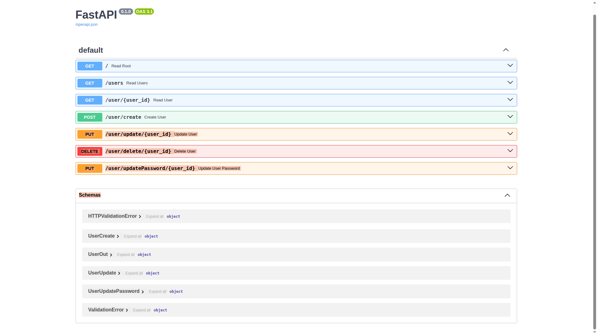

# ⚡ FastAPI User Management Microservice



> *Interactive OpenAPI documentation automatically generated by FastAPI.*

**[🌐 View Live API Documentation (Postman)](https://documenter.getpostman.com/view/54330326/2sBXqRiGMf)**

---

## 📖 Overview

As part of expanding my backend architecture toolkit into the Python ecosystem, I developed this standalone User Management Microservice. The goal of this project was to build a robust, high-performance RESTful API using modern asynchronous Python frameworks.

This service supports complete CRUD operations for user records, with features such as strict request validation, data serialization, and fully interactive API documentation.

---

## ✨ Features

- **High Performance:** Built with FastAPI and Starlette for asynchronous, non-blocking request handling.
- **Strict Data Validation:** Uses Pydantic schemas to validate request payloads, ensuring secure and predictable API interactions (e.g., detecting malformed email addresses or weak passwords before database processing).
- **Interactive API Documentation:** Automatically generates Swagger UI (`/docs`) and ReDoc (`/redoc`) documentation for easy API testing and frontend integration.
- **Postman Integration:** Fully tested and documented with a comprehensive Postman collection for streamlined endpoint verification.

---

## 🛣️ API Endpoints

| Method | Endpoint | Description |
|--------|-----------|-------------|
| `GET` | `/` | Health check / Root endpoint |
| `GET` | `/users` | Retrieve all users |
| `GET` | `/user/{user_id}` | Retrieve a specific user by ID |
| `POST` | `/user/create` | Create a new user |
| `PUT` | `/user/update/{user_id}` | Update existing user details |
| `PUT` | `/user/updatePassword/{user_id}` | Securely update a user's password |
| `DELETE` | `/user/delete/{user_id}` | Delete a user from the system |

---

## 🚀 Installation & Local Development

### 1️⃣ Clone the Repository

```bash
git clone https://github.com/Hari2892/fastapi-user-service.git
cd fastapi-user-service
```

### 2️⃣ Create and Activate a Virtual Environment

```bash
python -m venv venv
```

#### Linux / macOS

```bash
source venv/bin/activate
```

#### Windows

```bash
venv\Scripts\activate
```

### 3️⃣ Install Dependencies

```bash
pip install -r requirements.txt
```

**Core Dependencies:**

- FastAPI
- Uvicorn
- Pydantic

### 4️⃣ Run the Development Server

```bash
uvicorn main:app --reload
```

The API will be available at:

- Swagger UI: `http://localhost:8000/docs`
- ReDoc: `http://localhost:8000/redoc`

---

## 🧪 Testing with Postman

This repository includes a pre-configured Postman collection for testing all API endpoints.

### Steps

1. Locate the `Python FastAPI.postman_collection.json` file in the project root directory.
2. Import the collection into your Postman workspace.
3. Ensure the local FastAPI server is running.
4. Execute the requests directly from Postman.

---

## 👨‍💻 Author

### Hariharan R  
**Senior PHP & Full-Stack Developer**

- **[Portfolio](https://hariharan-bio-site.netlify.app/)**
- **[LinkedIn](https://www.linkedin.com/in/hariharan-r-55158515a/)**

---

## 📌 Future Improvements

- JWT Authentication & Authorization
- Database Integration (PostgreSQL / MongoDB)
- Docker Containerization
- Unit & Integration Testing
- CI/CD Pipeline Integration
- Role-Based Access Control (RBAC)